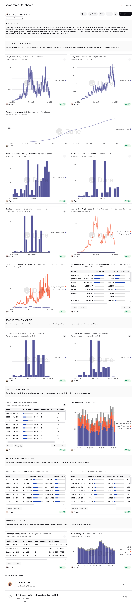

# Aerodrome Dashboard

A comprehensive analytics dashboard for monitoring and analyzing the Aerodrome protocol on the Base blockchain, built with Dune Analytics.

🔗 **[View Live Dashboard](https://dune.com/_john_/aerodrome-dashboard)**

## Overview

Aerodrome is a decentralized exchange (DEX) protocol designed as an on-chain liquidity engine, primarily built on the Base blockchain (an Ethereum Layer 2 network developed by Coinbase). This dashboard provides real-time insights into Aerodrome's liquidity provision, trading activity, user behavior, and protocol revenue.

## Dashboard Sections

### 1. Liquidity and TVL Analysis

**Metrics tracked:**
- **Daily Volume**: Real-time tracking of trading volume (currently ranging from 500M to 1.5B)
- **Daily Trades**: Number of trades executed daily (ranging from 200k to 800k)
- **Cumulative Volume**: Total trading volume over time (~20B+)

**Key insights:**
- Volume and trade patterns show significant growth from January 2024 to January 2026
- Notable peaks in October-November 2025 suggest major market events or protocol milestones
- Steady cumulative volume growth indicates healthy, sustained trading activity

### 2. Top Liquidity Pools

**Analysis includes:**
- **Average Trade Size**: Identifies pools with the largest average transactions
- **Total Trades**: Measures overall pool activity
- **Total Volume**: Tracks cumulative trading volume per pool

**Featured pools:**
- USDC/WETH - Primary trading pairs
- WETH/cbBTC - Bitcoin bridge trading
- msUSD/USDC - Stablecoin pairs

**Market share comparison:**
- Aerodrome leads with 45.6% market share among Base DEXs
- Outperforms competitors like Pancakeswap (26.9%), Uniswap (25.5%)
- Demonstrates superior average trade size ($756.25) compared to competitors

### 3. Trading Activity Analysis

**30-Day concentration metrics:**
- Volume and trade distribution across major pairs
- Identifies key trading corridors (EUR/USDC, USDC/WETH, WETH/cbBTC)
- Helps assess liquidity concentration and pool health

### 4. User Behavior Analysis

**User activity trends:**
- Daily active users ranging from 25k to 100k
- 100% new user percentage indicates strong user acquisition
- No returning users in recent data suggests either tracking methodology or early adoption phase

**User retention metrics:**
- 1-day, 7-day, and 30-day retention rates tracked via stacked visualization
- Historical retention data from August onwards shows user engagement patterns
- Peak retention periods align with protocol milestones

### 5. Protocol Revenue and Fees

**Financial metrics:**
- **Head-to-head comparison**: Weekly tracking of volume, trades, and fee generation across different protocols
- **Estimated protocol fees**: Both low and high estimates with annualized projections
- Recent weekly data shows:
  - Aerodrome volume: 13.5B+ (week ending Dec 29, 2025)
  - Uniswap volume: 12.8B+
  - Estimated fees: $240k-$1.47M (low-high range)

### 6. Advanced Analytics

**User segmentation by trade size:**
- Small (<$100): 10.8M trades, 2.04% of volume, average $22.16
- Medium ($100-$1K): 5.0M trades, 15.17% of volume, average $348.32
- Large ($1K-$10K): 1.6M trades, 41.34% of volume, average $2,951.75
- Whale (>$10K): 465K trades, 48.45% of volume, average $26,484.66

**Most active trading hours:**
- Peak activity: Hours 14-17 (UTC)
- Secondary peaks: Hours 1, 20-23
- Visualization shows clear diurnal trading patterns

## Data Sources

All data is sourced from blockchain transactions on the Base network via Dune Analytics:
- Real-time on-chain data aggregation
- Historical data dating back to January 2024
- Multi-protocol comparison data from other Base DEXs

## Key Insights

1. **Growth trajectory**: 733% increase in daily active users from ~15k to 100k over the analysis period
2. **Liquidity dominance**: Aerodrome controls 45.6% of Base DEX market share
3. **Whale activity**: Despite representing only 2.6% of trades, whales account for 48.45% of total volume
4. **Protocol maturity**: Consistent cumulative volume growth indicates sustainable adoption
5. **Fee generation**: Weekly fees ranging from $210k to $1.8M demonstrate strong revenue potential

## Technologies Used

- **Dune Analytics**: Query engine and visualization platform
- **SQL**: Data extraction and transformation
- **Base blockchain**: On-chain data source
- **Ethereum Layer 2**: Network infrastructure

## Dashboard Queries

This dashboard leverages multiple custom SQL queries to analyze:
- DEX transaction logs
- Liquidity pool events
- User wallet interactions
- Token swap events
- Fee collection mechanisms

## Use Cases

This dashboard is valuable for:
- **Liquidity providers**: Assessing pool performance and APY potential
- **Traders**: Identifying optimal trading pairs and market conditions
- **Researchers**: Analyzing DeFi adoption patterns and market efficiency
- **Protocol teams**: Benchmarking against competitors on Base
- **Investors**: Evaluating protocol health and growth metrics

## Contributing

Contributions, suggestions, and feedback are welcome! Feel free to:
- Fork the repository
- Submit pull requests with query improvements
- Open issues for feature requests or bug reports
- Share insights derived from the data

## Future Enhancements

Potential additions to the dashboard:
- [ ] Token-specific analysis (individual token pair deep dives)
- [ ] Liquidity provider profitability tracking
- [ ] Impermanent loss calculations
- [ ] Cross-chain comparison with other L2 DEXs
- [ ] Real-time alerts for significant market events
- [ ] MEV (Maximal Extractable Value) analysis

## License

This project is open source and available for public use. Data visualizations are powered by Dune Analytics.

## Author

Created by [@_john_](https://dune.com/_john_)

## Acknowledgments

- Aerodrome protocol team for building innovative DeFi infrastructure
- Base blockchain for providing scalable Layer 2 infrastructure
- Dune Analytics community for query optimization tips and best practices
- Coinbase for developing the Base network

---

**Disclaimer**: This dashboard is for informational purposes only and does not constitute financial advice. Always do your own research before making investment decisions.

**Last Updated**: January 2026
